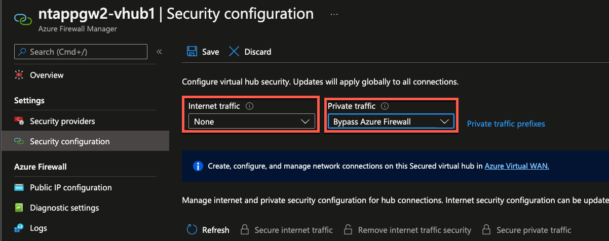

# How to deploy & configure Secured Virtual Hub using Terraform

## Introduction 
This post details configuration for implementing Secured Virtual Hubs using Terraform. Configuration detailed below uses Firewall Manager for implementing Internet Traffic and Private Traffic filtering. There are other methods for implementing traffic filter using Virtual WAN route tables which is not covered in this post. Firewall Manager provides easiest and the most simpliest method for implementing Internet and Private traffic filtering. 


---
Firewall Manager presentes options to configure Secured Virtual HUBs to filter Internet and Private Traffic. Below settings are available in the portal UI. 



---

## Configuring Firewall Manager Traffic filtering using Terraform 

Virtual WAN default route table contains special flags to allow above Firewall Manager configuration. These flags are documented in here which can be implemented using Powershell -> https://docs.microsoft.com/en-us/azure/firewall-manager/secure-cloud-network-powershell#deploy-azure-firewall-and-configure-custom-routing

In the example below we are implementing above configuration using Terraform 

below configuration implements both internet and private traffic filtering using Secured Hubs 

```terraform
resource "azurerm_virtual_hub_route_table_route" "fwroute" {
  route_table_id = "${azurerm_virtual_hub.vhub1.id}/hubRouteTables/defaultRouteTable"

    name = "all_traffic"
    destinations_type = "CIDR"
    destinations = ["0.0.0.0/0","10.0.0.0/8","172.16.0.0/12","192.168.0.0/16"]
    next_hop_type = "ResourceId"
    next_hop = azurerm_firewall.fwvhub1.id
}
```

below configuration implements private traffic filtering using Secured Hubs 

```terraform 
resource "azurerm_virtual_hub_route_table_route" "fwroute" {
  route_table_id = "${azurerm_virtual_hub.vhub1.id}/hubRouteTables/defaultRouteTable"

    name = "private_traffic"
    destinations_type = "CIDR"
    destinations = ["10.0.0.0/8","172.16.0.0/12","192.168.0.0/16"]
    next_hop_type = "ResourceId"
    next_hop = azurerm_firewall.fwvhub1.id
}
```

below configuration implements internet traffic filtering using Secured Hubs 

```terraform 
resource "azurerm_virtual_hub_route_table_route" "fwroute" {
  route_table_id = "${azurerm_virtual_hub.vhub1.id}/hubRouteTables/defaultRouteTable"

    name = "public_traffic"
    destinations_type = "CIDR"
    destinations = ["0.0.0.0/0"]
    next_hop_type = "ResourceId"
    next_hop = azurerm_firewall.fwvhub1.id
}
```

## Configuring VNET Connections to Virtual WAN 

Below configuration can be used for VNET Connections. Since we are using Secured Hub Firewall for traffic filter, we are propagating to None Routetable. 

```terraform
resource "azurerm_virtual_hub_connection" "hub_vnet2_con" {
  name                      = "${var.prefix}-hubvnet2con"
  virtual_hub_id            = azurerm_virtual_hub.vhub1.id
  remote_virtual_network_id = azurerm_virtual_network.workload_vnet2.id
  internet_security_enabled = true
    routing {
    associated_route_table_id = "${azurerm_virtual_hub.vhub1.id}/hubRouteTables/defaultRouteTable"
    propagated_route_table {
      route_table_ids = ["${azurerm_virtual_hub.vhub1.id}/hubRouteTables/noneRouteTable"]
    }
  }
}
```

If there's any need for diabling default route propagation, this can be set by disabling "Internet_security_enabled" flag to false as per my example below 

```terraform
resource "azurerm_virtual_hub_connection" "hub_vnet1_con" {
  name                      = "${var.prefix}-hubvnet1con"
  virtual_hub_id            = azurerm_virtual_hub.vhub1.id
  remote_virtual_network_id = azurerm_virtual_network.shared_vnet1.id
  internet_security_enabled = false
    routing {
    associated_route_table_id = "${azurerm_virtual_hub.vhub1.id}/hubRouteTables/defaultRouteTable"
    propagated_route_table {
      route_table_ids = ["${azurerm_virtual_hub.vhub1.id}/hubRouteTables/noneRouteTable"]
    }
  }
}
```
